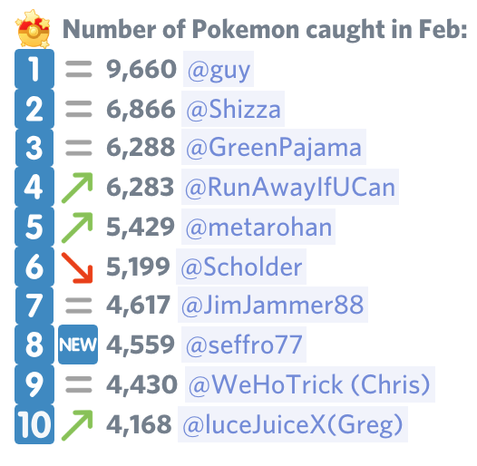

# BertBoards
_Pokemon GO Leaderboards for Discord_

These are the leaderboard scripts I created for the PoGO Los Angeles discord server.

It's only semi-automated. Every few days, I copy-and-paste the new entries from the
`#collect-jog-battle-xp` submission channel, run the scripts, and paste the current boards into `#leaderboards-next`.
In the first days of a new month I do the same, but the script spits out data for all the boards
(`#leaderboards`, `#leaderboards-full`, `#leaderboards-u40`, `leaderboards-alltime`).

Here are the steps to do at least once a week (I try to do it twice a week):
1. Copy all the submissions since last time from `#collect-jog-battle-xp` and paste them to a new file
   in the `raw/` dir. The file name is the current ISO time stamp, because dates in the discord channel
   are relative (e.g., 'Last Tuesday').
2. Run `./raw-to-data.py > data.txt` which creates the `data.txt` file from the `raw/` files.
3.Run `./leader.py` and copy the output to the `#leaderboards-next` channel.

I'm doing this on a Mac and use the `paste-raw.sh` shell script to automate steps 1 and 2.

To get the monthly boards I follow the exact same steps, except I only copy submissions up to midnight of
the last day of the month. The `./leader.py` script detects that, and creates all the boards.
